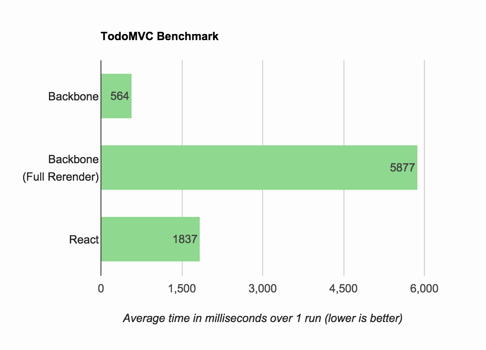

# TodoMVC Performance Comparison

React.js and Backbone.js performance comparison. Based on [evancz/todomvc-perf-comparison](https://github.com/evancz/todomvc-perf-comparison)

[**Run it yourself**][runner] to see how it works on your machine or in other browsers!

Here are some sample results from running this in Chrome 35 with OSX 10.9.4 on a Macbook Air:

[][runner]

[runner]: http://hokaccha.github.io/todomvc-perf-comparison/
